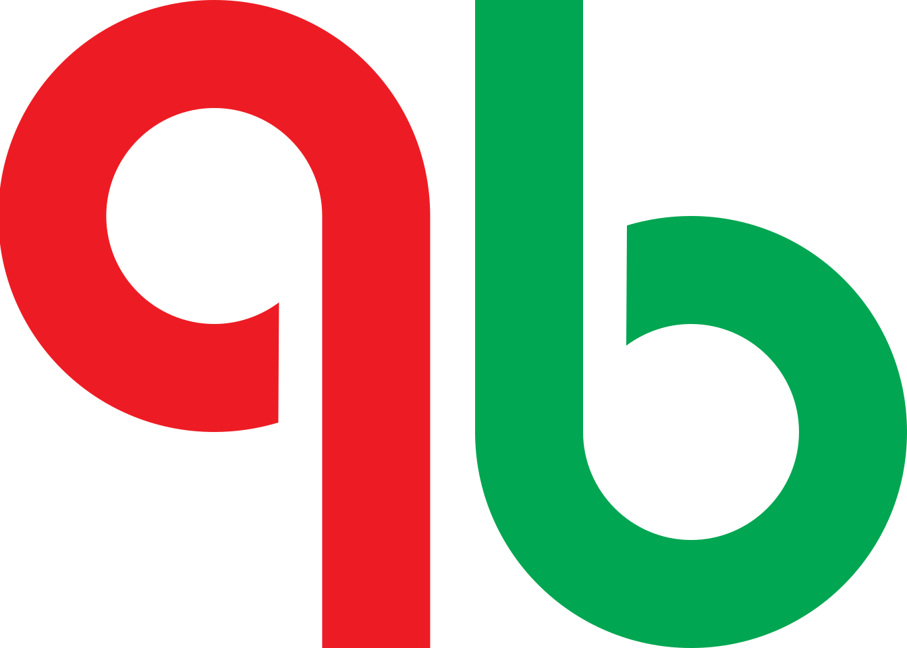
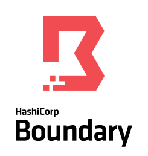
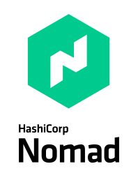

  

  

 
I'm a veteran software engineer with a passion for efficiency and productivity throughout the development workflow, from commit through the CI/CD pipeline to successful deployment. When I'm not developing automated pipelines or experimenting with new technologies, I can be found gaming or relaxing with my family.
 
 
I'm currently a Principal DevOps Engineer at <a href="https://tebra.com">Tebra</a> working to bring Tebra's platform to the cloud. Previously, I worked at Intuit as a Staff Software Engineer and Sony Online Entertainment as a Game Designer/Software Engineer.

  

  <b>CI/CD & VCS</b> 

    
    
    
    
    
    
    
    
    
    
    
    
    
    

 

  <b>Cloud Platforms & Operating Systems</b> 

    
    
    
    
    
    
    
    
    
    
    
    

 

  <b>Languages & Proficiencies</b> 

    
    
    
    
    
    
    
    
    
    
    
    
    
    

 

  <b>Software & Technology</b> 

    
    
    
    
    
    
    
    
    
    
    
    
    
    

