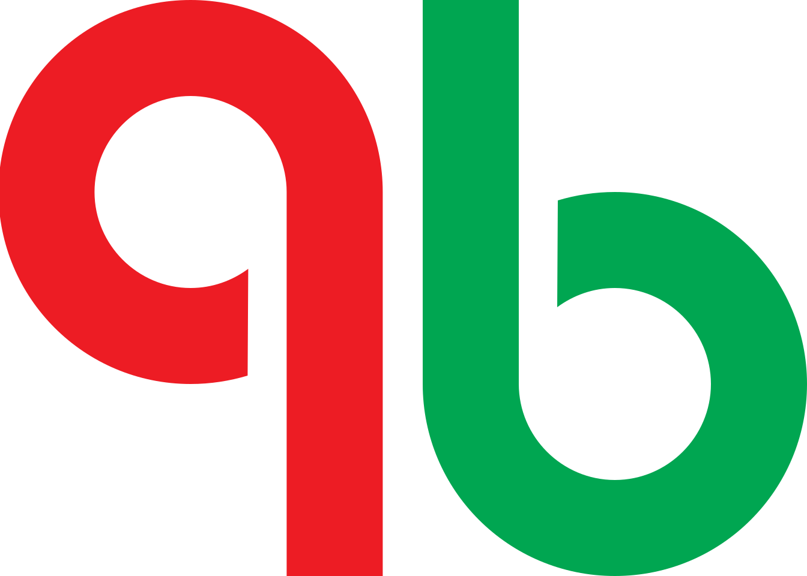

  

  

 
I'm a veteran software engineer with a passion for efficiency and productivity throughout the development workflow, from commit through the CI/CD pipeline to successful deployment. When I'm not developing automated pipelines or experimenting with new technologies, I can be found gaming or relaxing with my family.
 
 
I'm currently a Principal DevOps Engineer at <a href="https://tebra.com">Tebra</a> working to bring Tebra's platform to the cloud. Previously, I worked at Intuit as a Staff Software Engineer and Sony Online Entertainment as a Game Designer/Software Engineer.
  

<table align="center">

<tr>
<td valign="top">

  <h3>Cloud Services</h3>
  
  
  
  
  
  
  

</td>

<td valign="top">

  <h3>Operating Systems</h3>
  
  
  
  
  
  
  
  

</td>

<td valign="top">

  <h3>Version Control Systems</h3>
  
  
  
  
  
  

</td>
</tr>

<tr>
<td valign="top">

  <h3>CI/CD Platforms</h3>
  
  
  
  
  
  
  
  
  
  

</td>

<td valign="top">

  <h3>Programming Languages</h3>
  
  
  
  
  
  
  
  
  
  
  
  
  

</td>

<td valign="top">

  <h3>Technologies</h3>
  
  
  
  
  
  
  
  
  
  
  
  
  
  
  
  
  
  
  
  

</td>
</tr>

<tr>
<td valign="top">

</td>

<td valign="top">

  <h3>Tools</h3>
  
  
  
  
  
  
  
  
  
  
  
  
  
  
  
  
  
  <!--  -->
  
  
  
  
  
  

</td>

<td valign="top">

</td>
</tr>

</table>
